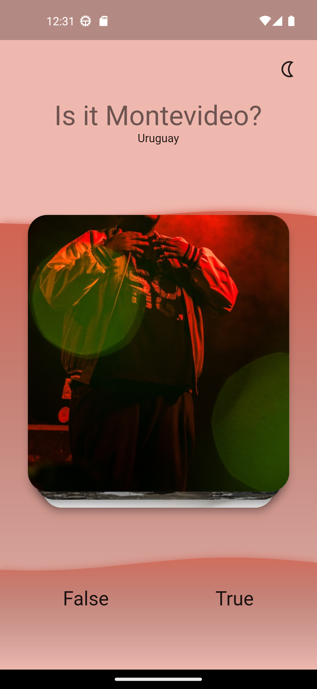
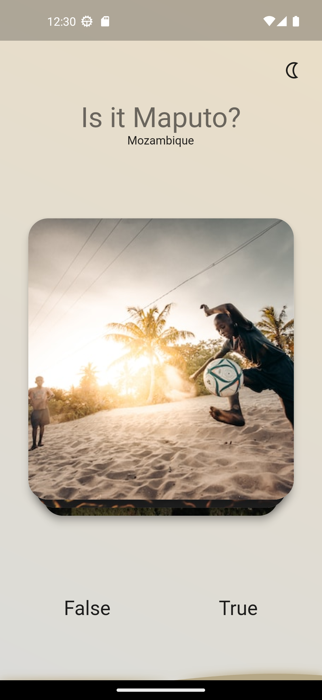
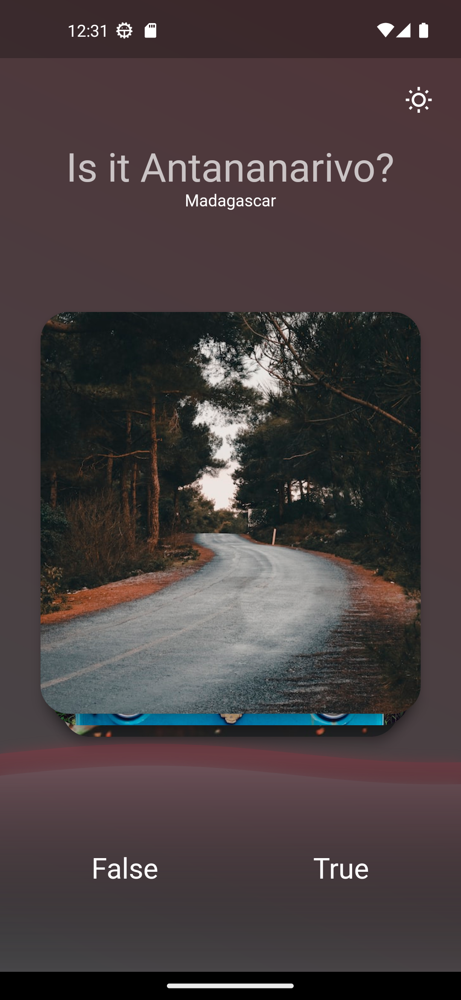

# Capitals Quiz
A game that will test how well you know the capitals of the world!

## App Overview

Looking through the branches you can see several different implementations of state management;

Tools used:

    - stream
    - provider
    - getit/injectable
    - bloc

## Folder Structure

    lib
    ├── data
    │   ├── data
    ├── domain
    │   ├── models
    │   ├── state    
    ├── ui
    │   ├── app
    │   ├── home
    └── main.dart

## Get started

An easy way to get started. 
Download and run